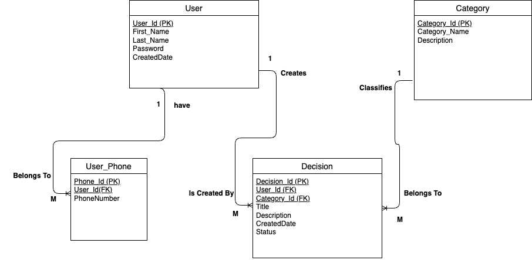

# DecisionLog

### Project Description:
DecisionLog is a web application that allows users to record and manage personal decisions. After registering and logging in, users can create, view, edit, and delete decision entries.

### Purpose:
The purpose of this application is to help users keep track of decisions they make and reflect on them later.

### Intended Users:
Students and individuals who want a simple tool for decision tracking and self-reflection.

### Key Features:
- User registration
- User login
- Create new decision entries
- View existing decisions
- Edit decisions
- Delete decisions

_________________

## ER Diagram

Below is the Entity Relationship Diagram for DecisionLog:

_________________

## Business Rules

A USER may create many DECISIONS. A DECISION is created by exactly one USER.

Each CATEGORY may classify many DECISIONS. Each DECISION must belong to exactly one CATEGORY.

A USER may have many PHONE_NUMBERS. Each PHONE_NUMBER must belong to exactly one USER.

