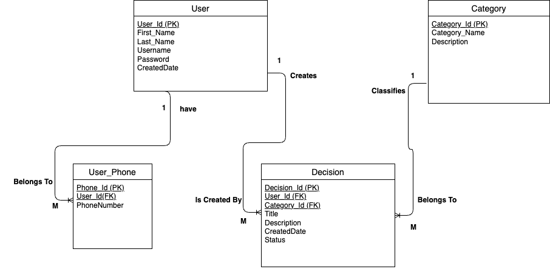
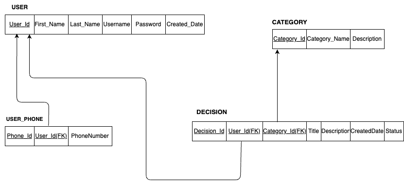

# DecisionLog

### Project Description:
DecisionLog is a web application that allows users to record and manage personal decisions. After registering and logging in, users can create and view decision entries.

### Purpose:
The purpose of this application is to help users keep track of decisions they make and reflect on them later.

### Intended Users:
Students and individuals who want a simple tool for decision tracking and self-reflection.

### Key Features:
- User registration
- User login
- Create new decision entries
- View existing decisions

_________________

## ER Diagram

ER Diagram is a visual diagram used in database design to show how data is organized and how different parts of the database relate to each other.

Below is the Entity Relationship Diagram for DecisionLog:

_________________

## Relational schema diagram / database relationship diagram

- Relations diagram shows the tables in a database, their columns, and how the tables are connected using primary keys and foreign keys.

- The purpose of this diagram in database design is to show the structure of the database after converting the ER diagram into tables. It helps developers understand which tables exist, what fields they contain, and how data is linked between tables.

_________________

## Business Rules

A USER may create many DECISIONS. A DECISION is created by exactly one USER.

Each CATEGORY may classify many DECISIONS. Each DECISION must belong to exactly one CATEGORY.

A USER may have many PHONE_NUMBERS. Each PHONE_NUMBER must belong to exactly one USER.

